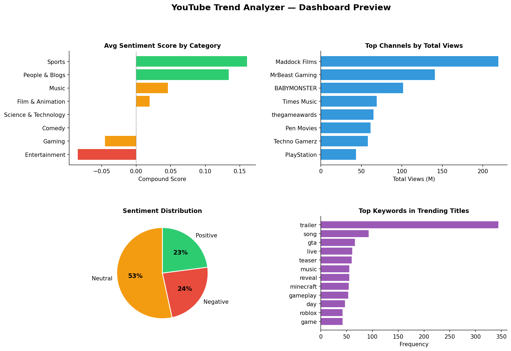
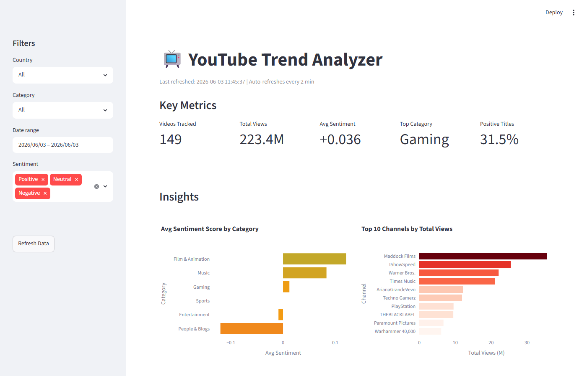

# 📺 YouTube Trend Analyzer

[](https://darshandharu-youtube-trend-analyzer.streamlit.app/)

> An automated data pipeline that fetches **real-time YouTube trending videos** daily,
> runs **NLP sentiment analysis** on titles, and surfaces insights through a live
> **Streamlit dashboard** — with GitHub Actions keeping it updated automatically.

---

## 📸 Dashboard Preview





---

## ✅ Features

- **Real-time API ingestion** — Fetches top 50 trending videos per country (US 🇺🇸 · IN 🇮🇳 · GB 🇬🇧) via YouTube Data API v3
- **NLP Sentiment Analysis** — VADER scores every video title (Positive / Neutral / Negative)
- **SQLite persistence** — All data stored locally; no database server required
- **Live Streamlit Dashboard** — 5 KPI cards, 5 interactive Plotly charts, sidebar filters, searchable video table
- **Automated Daily Pipeline** — GitHub Actions fetches fresh data every day at 10 AM UTC
- **Offline chart generator** — Reproducible README visuals without running the dashboard

---

## 🛠 Tech Stack

| Layer              | Tool                          |
|--------------------|-------------------------------|
| Language           | Python 3.11+                  |
| Data Source        | YouTube Data API v3           |
| Sentiment NLP      | VADER (vaderSentiment)        |
| Data Processing    | Pandas                        |
| Database           | SQLite (via SQLAlchemy)       |
| Dashboard          | Streamlit + Plotly            |
| Offline Charts     | Matplotlib                    |
| Automation         | GitHub Actions (daily cron)   |
| Version Control    | GitHub                        |

---

## 📁 Project Structure

```
youtube-trend-analyzer/
├── .github/
│   └── workflows/
│       └── daily_fetch.yml        # GitHub Actions daily pipeline
├── data/
│   └── trends.db                  # SQLite database (auto-created)
├── scripts/
│   ├── fetch_trends.py            # YouTube API → raw records
│   ├── sentiment_analysis.py      # VADER sentiment scoring
│   ├── database.py                # SQLite schema + helpers
│   ├── pipeline.py                # Master orchestrator
│   ├── dashboard.py               # Streamlit live dashboard
│   └── generate_charts.py         # Offline PNG charts for README
├── screenshots/                   # Chart images for README
├── .env.example                   # Credential template
├── requirements.txt
└── README.md
```

---

## 🚀 Quick Start

### 1. Clone & install
```bash
git clone https://github.com/darshandharu/youtube-trend-analyzer.git
cd youtube-trend-analyzer
pip install -r requirements.txt
```

### 2. Configure your API key
```bash
cp .env.example .env
# Edit .env and add your YouTube Data API v3 key
# Get one free at: https://console.cloud.google.com
```

### 3. Run the pipeline
```bash
python scripts/pipeline.py
```

### 4. Launch the dashboard
```bash
streamlit run scripts/dashboard.py
```

### 5. Regenerate offline charts
```bash
python scripts/generate_charts.py
```

---

## 📊 Dashboard KPIs

| KPI | Description |
|-----|-------------|
| Videos Tracked | Total unique videos in the filtered view |
| Total Views | Combined view count across all trending videos |
| Avg Sentiment | Mean VADER compound score (-1 to +1) |
| Top Category | Most represented video category |
| Positive Titles | % of video titles with positive sentiment |

---

## 🤖 Automated Daily Pipeline (GitHub Actions)

The workflow runs every day at **10 AM UTC**:
1. Fetches 50 trending videos × 3 countries from YouTube API
2. Scores each title with VADER sentiment analysis
3. Inserts new records into SQLite (skips duplicates)
4. Regenerates README charts
5. Commits and pushes the updated database

Trigger a manual run anytime from the **Actions tab → Daily YouTube Trend Fetch → Run workflow**.

> To enable: add your YouTube API key as a GitHub Secret named `YOUTUBE_API_KEY`
> (Settings → Secrets and variables → Actions → New repository secret)

---

## 🔮 Future Improvements

| Enhancement | Why it matters |
|-------------|---------------|
| **More countries** | Add JP, BR, KR for global trends comparison |
| **Channel enrichment** | Fetch subscriber counts for channel-level analytics |
| **Topic clustering** | Group videos by theme using TF-IDF or BERTopic |
| **Streamlit Cloud** | Deploy dashboard publicly — shareable link |
| **BigQuery** | Scale to years of data with cloud warehouse |
| **Slack/email alerts** | Notify when sentiment drops or a topic spikes |

---

## 👤 Author

**Darshan**
Data Engineer | Python · SQL · APIs · NLP · Streamlit
📧 darshandharu0@gmail.com

---

*Built to demonstrate real-world data engineering skills — API integration, NLP, automated pipelines, and interactive dashboards.*
